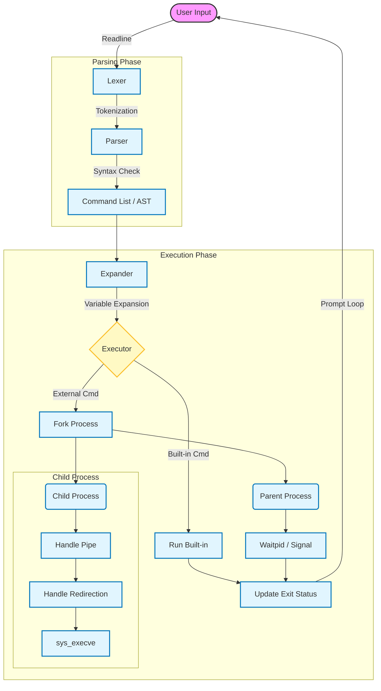

# 42_minishell

**42_minishell**은 Bash와 유사한 동작을 수행하는 간단한 쉘(Shell)을 구현한 프로젝트입니다. C 언어로 작성되었으며, 명령어 실행, 파이프라인, 리다이렉션, 환경 변수 처리 등 쉘의 핵심 기능을 포함하고 있습니다.

## 📋 목차
- [개요](#개요)
- [아키텍처](#-아키텍처)
- [주요 기능](#주요-기능)
- [빌드 및 설치](#빌드-및-설치)
- [실행 방법](#실행-방법)
- [프로젝트 구조](#프로젝트-구조)

## 📝 개요
이 프로젝트는 유닉스 쉘의 동작 원리를 이해하기 위해 프로세스 생성, 파일 디스크립터 관리, 시그널 핸들링, 환경 변수 관리 등을 직접 구현하였습니다. `readline` 라이브러리를 사용하여 사용자 입력을 받고, 렉싱(Lexing) 및 파싱(Parsing) 과정을 거쳐 명령어를 실행합니다.

## 🏗 아키텍처

Minishell의 데이터 처리 흐름과 실행 구조는 다음과 같습니다.



1.  **Lexer**: 사용자 입력을 토큰 단위로 분리합니다.
2.  **Parser**: 토큰을 분석하여 실행 가능한 명령어 리스트(또는 트리) 구조로 변환합니다.
3.  **Expander**: 환경 변수(`$HOME` 등)를 실제 값으로 치환합니다.
4.  **Executor**: 명령어가 내장(Built-in)인지 외부 명령어인지 판단하여 실행합니다. 파이프와 리다이렉션 처리가 여기서 이루어집니다.

## ✨ 주요 기능

### 1. 내장 명령어 (Built-ins)
다음과 같은 쉘 내장 명령어를 지원합니다:
- **`echo`**: 옵션 `-n`을 지원하며 문자열을 출력합니다.
- **`cd`**: 디렉토리를 이동합니다 (상대/절대 경로, `~`, `-` 지원).
- **`pwd`**: 현재 작업 디렉토리를 출력합니다.
- **`export`**: 환경 변수를 설정합니다.
- **`unset`**: 환경 변수를 해제합니다.
- **`env`**: 현재 환경 변수 목록을 출력합니다.
- **`exit`**: 쉘을 종료하며 종료 상태 코드를 반환합니다.

### 2. 명령어 실행
- **외부 명령어 실행**: `PATH` 환경 변수를 기반으로 실행 파일을 찾아 실행합니다.
- **절대/상대 경로 실행**: 경로가 지정된 실행 파일을 실행합니다.

### 3. 리다이렉션 & 파이프
- **리다이렉션**: `<`, `>`, `>>`, `<<` (Here-doc) 지원
- **파이프라인**: `|`를 사용하여 다중 명령어 연결 지원

## 🛠 빌드 및 설치

이 프로젝트는 `Makefile`을 포함하고 있습니다. 터미널에서 다음 명령어를 실행하여 빌드할 수 있습니다.

### 필수 요구 사항
- `gcc` 또는 `clang` 컴파일러
- `make`
- `readline` 라이브러리

### 컴파일
```bash
make
```

### 정리
- 오브젝트 파일 삭제: `make clean`
- 실행 파일 및 라이브러리 삭제: `make fclean`
- 재빌드: `make re`

## 🚀 실행 방법

빌드가 완료되면 다음 명령어로 쉘을 시작할 수 있습니다.

```bash
./minishell
```

```bash
minishell$ ls -l | grep .c
minishell$ echo "Hello 42" > outfile
minishell$ cat < outfile
```

## 📂 프로젝트 구조

```
.
├── includes/          # 헤더 파일 (minishell.h)
├── Libft/             # Libft 라이브러리
├── srcs/              # 소스 코드
│   ├── builtin*.c     # 내장 명령어 (cd, echo, exit 등)
│   ├── env_*.c        # 환경 변수 관리
│   ├── exec*.c        # 실행 로직 (파이프, 프로세스 생성)
│   ├── lex*.c         # 렉서 (Tokenizing)
│   ├── parsing.c      # 파서 (Syntax Analysis)
│   ├── redirect.c     # 리다이렉션 처리
│   ├── signal*.c      # 시그널 핸들링 (Ctrl+C, Ctrl+\)
│   └── ...
├── Makefile           # 빌드 설정
└── README.md
```

## 👥 작성자
- **juyoukim**
- **taewonki**
